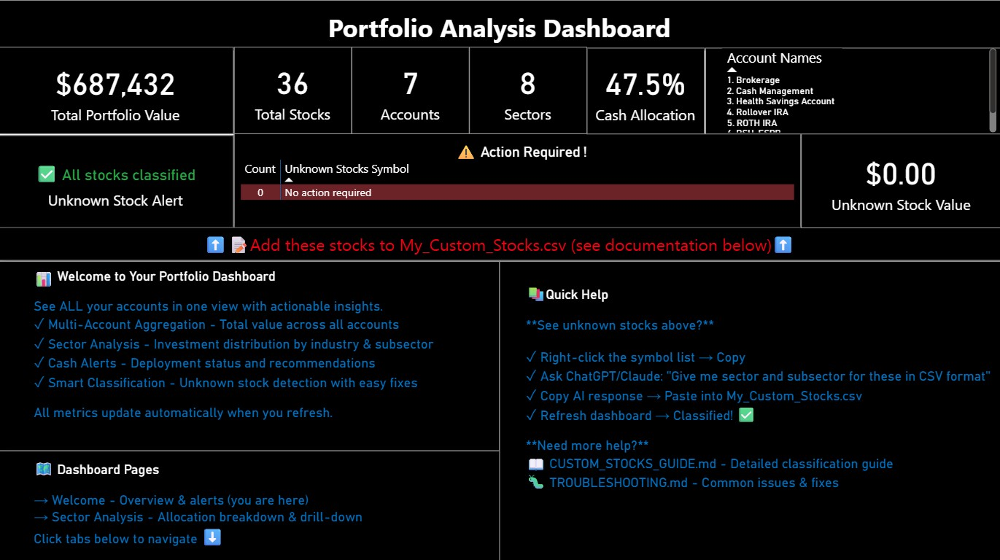
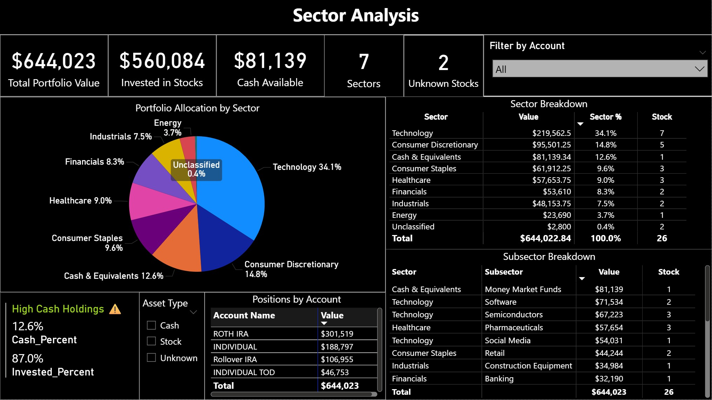

# 📊 Portfolio Analysis Dashboard

**Aggregate ALL your investment accounts in one view. Get insights your broker can't provide.**

Built by [Sumit Girdhar](https://www.linkedin.com/in/sumitgirdhar/) with Claude AI

---

## 🎯 What This Solves

**Your broker shows accounts separately. This shows everything together.**

✅ **Total portfolio value** across ALL accounts (IRA, Roth, Individual, TOD)  
✅ **True sector allocation** - not account-by-account confusion  
✅ **Smart alerts** - high cash positions, unknown stocks  
✅ **Subsector analysis** - See Semiconductors vs Software within Technology  
✅ **Custom classifications** - Add stocks your broker doesn't recognize  
✅ **100% private** - Offline only, no cloud, no login  

**Compatible with:** Fidelity, Schwab, Vanguard, E*TRADE

---

## 📸 See It In Action

### Welcome Dashboard

*Total portfolio • Account breakdown • Cash alerts • Unknown stocks*

### Sector Analysis

*Visual allocation • Subsector drill-down • Position tracking*

---

## 🚀 Quick Start

### **5-Minute Setup**

1. **Download Files:**
   - `PortfolioAnalysisDashboard.pbix`
   - `stock_reference_base.csv`
   - `My_Custom_Stocks.csv`
   
   📥 [Get from Releases](https://github.com/girdharsumit-ctrl/portfolio-analysis-dashboard/releases)

2. **Install PowerBI Desktop** (free):  
   [Download from Microsoft](https://powerbi.microsoft.com/desktop/)

3. **Export your portfolio:**
   - Fidelity: Accounts → All Accounts → Positions → Download CSV
   - Other brokers: Export positions with accounts, symbols, quantities, prices

4. **Open & Connect:**
   - Open the .pbix file
   - Point it to your CSV files
   - Done! ✅

📖 **Detailed walkthrough:** [SETUP_GUIDE.md](SETUP_GUIDE.md)

---

## ✨ Key Features

### **Actionable Intelligence**
Not just data - actual insights:
- ⚠️ "You have $45K in cash (12.6%) - Consider deploying"
- 🔍 "3 stocks need classification: HUCKOO, LLY, PUCOO"
- 💡 Direct links to fix issues

### **Multi-Level Analysis**
- **Portfolio:** Total value, accounts, cash %
- **Sector:** Technology 34.1% = $219K
- **Subsector:** Semiconductors $67K | Software $71K
- **Position:** Individual stock allocations

### **Flexible Classification**
Reference includes 300+ major stocks. Missing one? Add it in 2 minutes - stays forever.

### **Privacy First**
Your financial data never leaves your computer. No cloud. No API. No tracking.

---

## 📚 Documentation

**Start Here:**
- [SETUP_GUIDE.md](SETUP_GUIDE.md) - Full installation guide
- [CUSTOM_STOCKS_GUIDE.md](CUSTOM_STOCKS_GUIDE.md) - Add your own stocks
- [FAQ.md](FAQ.md) - Common questions
- [TROUBLESHOOTING.md](TROUBLESHOOTING.md) - Fix issues

**Deep Dive:**
- [PRODUCT_ROADMAP.md](PRODUCT_ROADMAP.md) - Future features & timeline
- [PROJECTS_RECRUITER.md](PROJECTS_RECRUITER.md) - Detailed project info

---

## 🎯 Roadmap

**v1.0 (Live Now):** Multi-account aggregation, sector analysis, alerts  
**v2.0:** Time-based performance, holding period analysis  
**v3.0:** Divident Income Tracking / Tax planning, rebalancing, risk analytics, dividends  

📋 [Full roadmap with details](PRODUCT_ROADMAP.md)

---

## 🤝 Contribute

Contributions welcome! This is open source.

- 🐛 [Report bugs](https://github.com/girdharsumit-ctrl/portfolio-analysis-dashboard/issues)
- ☕ [Buy me a coffee](buymeacoffee.com/girdharsumit) (optional)!
---

## 📞 Contact

**Sumit Girdhar**  
📧 girdharsumit@gmail.com (Add "PAD" in subject)  
💼 [LinkedIn](https://www.linkedin.com/in/sumitgirdhar/)  
🔗 [GitHub](https://github.com/girdharsumit-ctrl)

---

## 🙏 Acknowledgments

Built with Claude AI (Anthropic) • Thanks to PowerBI community & early testers

**If this helped you:**
- ⭐ Star the repository
- 🔄 Share with fellow investors
- 🐛 Report issues to improve it

---

## 📜 License

MIT License - Use freely, attribution appreciated. See [LICENSE](LICENSE).

---

## ⚠️ Disclaimer

Educational tool only. Not financial advice. Consult professionals for investment decisions.

---

**Built with ❤️ for investors who want control over their data**

*Version 1.0 | November 2025*
