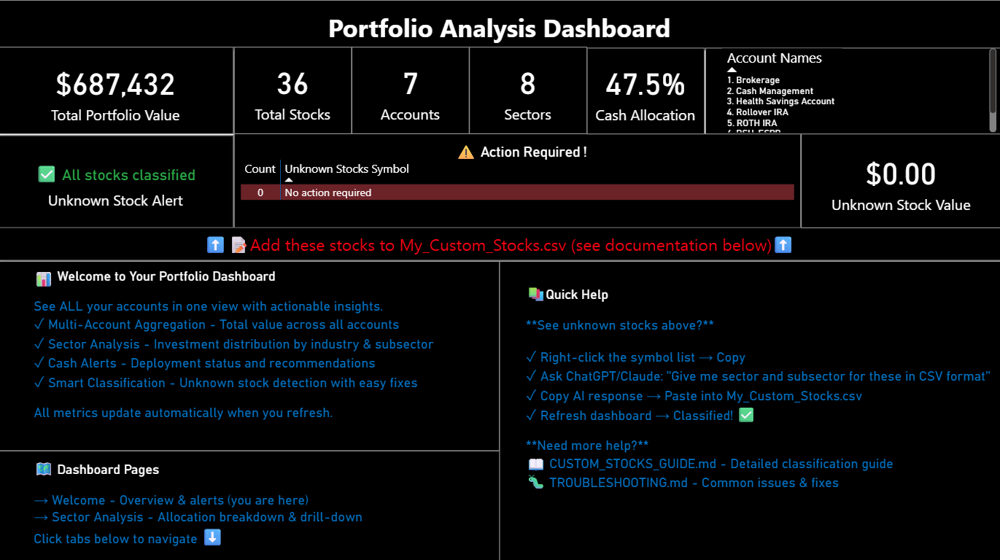

# 📊 Portfolio Analysis Dashboard (PAD)

**Your broker shows you WHAT you own. This shows you what to DO about it.**

[](https://powerbi.microsoft.com/)
[](LICENSE)
[]()

Built by **[Your Name]** with assistance from Claude AI (Anthropic)

---

## 🎯 The Problem

You have multiple investment accounts (IRA, Roth, Individual, TOD). Your broker shows each account separately. You want to see:

- **How much do I REALLY have in Technology across ALL accounts?**
- **Am I holding too much cash? Should I deploy it?**
- **Do I own the same stock in 3 different accounts?**
- **Which sectors am I overexposed to?**
- **What about those stocks my broker labels as "Other"?**

**Your broker can't answer these questions.** This dashboard can.

---

## 🚀 What Is This?

Portfolio Analysis Dashboard (PAD) **aggregates ALL your investment accounts** into a single analytical powerhouse. 

Unlike your broker's interface, this gives you:
- ✅ **Cross-account aggregation** - See your true portfolio, not siloed accounts
- ✅ **Actionable alerts** - "3 stocks need classification - here's how to fix"
- ✅ **Cash deployment intelligence** - Is 12.6% cash strategic or wasteful?
- ✅ **Custom classifications** - Add stocks your broker doesn't recognize
- ✅ **Subsector granularity** - See concentration within Technology, Healthcare, etc.
- ✅ **Offline privacy** - Your data never leaves your computer
- ✅ **100% free** - No subscriptions, no cloud accounts, no tracking

**Works directly with Fidelity, Schwab, Vanguard, E*TRADE exports.**

---

## ✨ Key Features

### 🎯 What Your Broker CAN'T Show You

#### **Multi-Account Intelligence**
Your broker forces you to view accounts one at a time. Switch between IRA, then Roth, then Individual, trying to mentally add things up.

**This dashboard:**
- Aggregates ALL accounts in unified view
- Shows total portfolio value: **$644,753** across **4 accounts**
- Displays positions held in multiple accounts side-by-side
- Filters by account or view holistically with one click
- Answers: "Do I own AAPL in multiple accounts?" instantly

#### **Actionable Alerts (Not Just Data)**
Your broker shows numbers. This dashboard tells you what to DO.

**Example Alerts You'll See:**

🚨 **Unknown Stock Alert**
```
⚠️ 3 stock(s) need classification
HUCKOO, LLY, PUCOO
Unknown Stock Value: $25,840.50
→ Add these stocks to My_Custom_Stocks.csv (see documentation)
```

⚠️ **Cash Deployment Warning**
```
High Cash Holdings ⚠️
12.6% Cash Allocation ($81,139)
Status: Significantly Under-Invested 🚨
→ Consider deploying excess cash into strategic positions
```

**Your broker just says:** "Cash: $81,139"  
**This dashboard says:** "You're under-invested - here's why that matters"

#### **Smart Cash Management**
Stop guessing if your cash position is strategic or accidental.

**Cash Intelligence Features:**
- **Visual Status Indicators:**
  - Fully Deployed ✅ (0-5% cash)
  - Moderate Cash Reserve (5-10% cash)
  - High Cash Holdings ⚠️ (10-20% cash)
  - Significantly Under-Invested 🚨 (>20% cash)

- **Deployment Metrics:**
  - Cash Available: $81,139
  - Invested Percent: 87.0%
  - Cash Percent: 12.6%

**Why this matters:** Understand if cash is strategic dry powder or opportunity cost.

#### **Custom Stock Classification System**
Your broker labels small-cap, pharmaceutical, or niche stocks as "Unknown" or "Other."

**This dashboard:**
- Comes with 500+ pre-classified stocks
- **YOU add custom stocks** (LLY, HUCKOO, emerging stocks)
- Classifications **persist forever** across monthly refreshes
- **Override default sectors** if you disagree (TSLA = Tech or Auto? Your choice!)

**Result:** Zero "Unknown" clutter. Every position properly categorized YOUR way.

#### **Deep Sector & Subsector Analysis**
Your broker: "Technology: $219,562 (34.1%)"

**This dashboard shows:**

**Sector Level:**
- Technology: $219,562 (34.1%) - 7 stocks
- Consumer Discretionary: $95,501 (14.8%) - 5 stocks
- Cash & Equivalents: $81,139 (12.6%) - 2 positions

**Subsector Granularity:**
- Technology → Software: $71,534 (2 stocks)
- Technology → Semiconductors: $67,223 (3 stocks)
- Technology → Social Media: $54,031 (1 stock)

**Stock Level:**
- Individual position allocation
- Holdings across multiple accounts
- Concentration risk identification

**Why this matters:** Discover you're not "diversified in Tech" - you're 60% semiconductors!

#### **Cross-Account Position Tracking**
See the SAME stock held across multiple accounts.

**Example View:**
```
Positions by Account:
- ROTH IRA:        $301,519
- INDIVIDUAL:      $188,797
- Rollover IRA:    $106,555
- INDIVIDUAL TOD:   $46,753
Total:             $644,023 across 26 positions
```

**Identify:**
- Duplicate holdings across accounts
- Total exposure to single stocks
- Account-level diversification
- Where to rebalance first

#### **Offline Privacy & Control**
No login. No cloud. No data transmission. No security questions.

**Your data stays:**
- ✅ 100% on your local computer
- ✅ Never uploaded anywhere
- ✅ Never shared with anyone
- ✅ Completely private

**Works offline** - Analyze even without internet. Your financial data is YOUR business.

---

## 📊 Dashboard Pages Explained

### **Welcome Page - Portfolio Command Center**

Your **mission control** for entire portfolio. See at a glance:

**Top Metrics Bar:**
- 💰 **$644,753** - Total Portfolio Value (all accounts)
- 📈 **22 stocks** - Total unique positions
- 🏦 **4 accounts** - All investment accounts aggregated
- 🎯 **7 sectors** - Diversification across industries
- 💵 **12.6%** - Cash allocation percentage

**Action Required Section:**
Real-time alerts for positions needing attention:
- Unknown stocks with specific symbols listed
- Dollar value of unclassified positions
- Direct link to fix documentation

**Account Overview:**
- List of all accounts being tracked
- Quick reference for account structure

**Navigation Hub:**
- Links to detailed analysis pages
- Monthly update instructions
- Help documentation access

**Why this page matters:** One-glance health check of entire portfolio. Spot issues immediately.

---

### **Sector Analysis Page - Deep Portfolio Insights**

Your **analytical engine** for understanding true allocation.

**Portfolio Summary Metrics:**
- Total Portfolio Value: $644,023
- Invested in Stocks: $560,084 (87.0%)
- Cash Available: $81,139 (12.6%)
- Number of Sectors: 7
- Unknown Stocks: 2 positions flagged

**Visual Sector Allocation:**
Interactive pie chart showing:
- Technology: 34.1% (dominant sector)
- Consumer Discretionary: 14.8%
- Cash & Equivalents: 12.6%
- Consumer Staples: 9.6%
- Healthcare: 9.0%
- Financials: 8.3%
- Industrials: 7.5%
- Energy: 3.7%
- Unclassified: 0.4%

**Sector Breakdown Table:**
Detailed sector analysis with:
- Dollar values per sector
- Percentage allocation
- Stock count per sector
- Sort and filter capabilities

**Subsector Breakdown Table:**
Granular analysis showing:
- Money Market Funds: $81,139
- Software: $71,534 (within Technology)
- Semiconductors: $67,223 (within Technology)
- Pharmaceuticals: $57,654 (within Healthcare)
- Social Media: $54,031 (within Technology)
- And more...

**Positions by Account:**
See exactly which account holds what:
- ROTH IRA holdings and value
- INDIVIDUAL account positions
- Rollover IRA breakdown
- INDIVIDUAL TOD details

**Cash Deployment Analysis:**
- Current cash percentage with status indicator
- Invested vs. cash split
- Asset type filtering (Cash | Stock | Unknown)

**Why this page matters:** Understand WHERE your money actually is. Discover concentration risks. Make informed rebalancing decisions.

---

## 🆚 This vs. Your Broker

| Feature | Fidelity/Schwab | Personal Capital | PAD |
|---------|----------------|------------------|-----|
| **Multi-account view** | One at a time | ✅ Yes | ✅ Yes |
| **Offline access** | ❌ No | ❌ No | ✅ Yes |
| **Custom sectors** | ❌ Fixed | ❌ Fixed | ✅ Fully customizable |
| **Subsector analysis** | ❌ No | ⚠️ Limited | ✅ Complete |
| **Cash deployment alerts** | ❌ No | ❌ No | ✅ Intelligent warnings |
| **Unknown stock handling** | Shows as "Other" | ❌ Ignores | ✅ Alert + fix guidance |
| **Privacy** | Cloud-based | Cloud-based | ✅ 100% local |
| **Cost** | Free | $9-15/month | ✅ Free forever |
| **Customizable** | ❌ No | ❌ No | ✅ Full code access |
| **Data ownership** | They own it | They own it | ✅ YOU own it |

---

## 💡 Real-World Use Cases

### **Discovery: Hidden Concentration Risk**
> "I thought I was diversified with 7 sectors. The dashboard showed me I had 34% in Technology, but 22% of that was semiconductors alone. I was way overexposed to chip companies across multiple accounts without realizing it."

### **Action: Cash Deployment**
> "I had $81K sitting in cash across accounts thinking it was 'about 8-10%'. Dashboard showed me it was actually 12.6% - significantly under-invested. That $20K extra could have been working for me."

### **Insight: Cross-Account Duplication**
> "Discovered I owned the same dividend stock in 3 different accounts. Using the dashboard, I consolidated into my Roth IRA for tax-free growth instead of spreading it across taxable accounts."

### **Fix: Unknown Stock Classification**
> "My broker labeled my pharmaceutical stocks as 'Other'. Added them to custom stocks file once. Now they're forever categorized correctly and I can track Healthcare sector properly."

---

## 🚀 Quick Start (5 Minutes)

### Prerequisites
- **PowerBI Desktop** (free from Microsoft)
- **Portfolio CSV export** from your broker (Fidelity, Schwab, Vanguard, etc.)

### Installation

1. **Download the dashboard:**
   ```bash
   git clone https://github.com/[yourusername]/portfolio-analysis-dashboard.git
   ```

2. **Open in PowerBI:**
   - Double-click `PortfolioAnalysisDashboard.pbix`
   - PowerBI Desktop will open

3. **Import your data:**
   - Home tab → Transform Data
   - Update file paths to your portfolio CSV
   - Close & Apply

4. **Done!** Your dashboard is now tracking your investments.

📖 **Need detailed steps?** See [SETUP_GUIDE.md](SETUP_GUIDE.md)

---

## 📸 Screenshots

### Welcome Page - Portfolio Command Center


**At a glance:**
- Total portfolio value across ALL accounts
- Quick metrics: stocks, accounts, sectors, cash %
- Unknown stock alerts with actionable guidance
- Account list for reference
- Navigation to detailed analysis

---

### Sector Analysis - Deep Insights


**Detailed view:**
- Visual pie chart of sector allocation
- Sector breakdown with dollar values and percentages
- Subsector granularity (Software, Semiconductors, etc.)
- Positions by account table
- Cash deployment status with warnings
- Filter by account capability

---

### Position Details (Coming in v1.1)


**Individual stock tracking:**
- Per-position performance metrics
- Cost basis and current value
- Gain/loss tracking
- Account-level position details

---

## 💾 Data Format

Works with **standard brokerage exports** - no manual editing required!

### Supported Brokers:
- ✅ **Fidelity** (native format - just download & import)
- ✅ **Schwab** (minor column mapping)
- ✅ **Vanguard** (minor column mapping)
- ✅ **E*TRADE** (minor column mapping)
- ✅ **Others** (see format guide)

### Required Data:
- Account information
- Stock symbols
- Quantities & prices
- Cost basis
- Current values

📋 **Full format details:** [CSV_FORMAT_GUIDE.md](CSV_FORMAT_GUIDE.md)

---

## 🎓 How It Works

### 1. Data Import (Power Query)
- Connects to your CSV files
- Cleans data automatically (removes blanks, footer text)
- Converts currency/percentages
- Creates relationships between tables

### 2. Classification (Stock Reference)
- Matches your stocks against 500+ pre-classified symbols
- Assigns sectors/subsectors automatically
- Checks custom stocks file for YOUR additions
- Flags unknown stocks for review with specific alerts

### 3. Calculations (DAX Measures)
- 27+ built-in measures for comprehensive analysis
- Portfolio value & performance tracking
- Sector allocation percentages with visual breakdowns
- Gain/loss metrics across accounts
- Cash position tracking with deployment status
- Unknown stock identification and alerts

### 4. Visualizations (Reports)
- Interactive charts & tables with drill-down capability
- Click to filter and explore deeper
- Responsive design across pages
- Professional formatting with clear metrics
- Actionable insights, not just data display

🔧 **Want to customize?** The .pbix file is fully editable - all DAX and Power Query code is accessible for learning and modification.

---

## 📚 Documentation

- **[SETUP_GUIDE.md](SETUP_GUIDE.md)** - Detailed installation & configuration
- **[CSV_FORMAT_GUIDE.md](CSV_FORMAT_GUIDE.md)** - Data format requirements
- **[CUSTOM_STOCKS_GUIDE.md](CUSTOM_STOCKS_GUIDE.md)** - How to add stocks not in reference
- **[FAQ.md](FAQ.md)** - Common questions & troubleshooting

---

## 🎯 Roadmap

### ✅ v1.0 (Current - Available Now)
- Multi-account portfolio tracking
- Sector & subsector allocation analysis
- Cash deployment intelligence with alerts
- Unknown stock detection and guidance
- Custom stock classification system
- Actionable alerts and warnings
- Cross-account position visibility
- 100% offline privacy

### 🔮 v2.0 (Planned - Q1 2026)
- Historical performance tracking over time
- Tax planning features (short-term vs long-term gains)
- Rebalancing recommendations based on targets
- Risk analytics (beta, volatility metrics)
- Dividend tracking & income analysis
- Automated monthly refresh scheduling
- Performance attribution analysis
- Export capabilities (Excel, PDF reports)

**Want to contribute?** See [CONTRIBUTING.md](CONTRIBUTING.md) for guidelines.

---

## 🤝 Contributing

This is an open-source project, and contributions are welcome!

### Ways to Contribute:
- 🐛 **Report bugs** - Open an issue
- 💡 **Suggest features** - Share your ideas
- 📖 **Improve docs** - Submit pull requests
- 📊 **Expand stock reference** - Add more classified stocks
- ⭐ **Star the repo** - Show support
- 🔗 **Share** - Help others discover this tool

---

## 📜 License

This project is licensed under the **MIT License** - see [LICENSE](LICENSE) file for details.

### Attribution
If you use this dashboard or build upon it:
- ⭐ Star this repository
- 🔗 Link back to this project
- 💬 Mention: "Built with Portfolio Analysis Dashboard by [Your Name]"

---

## 🏆 Credits

**Built by:** [Your Name]  
**With assistance from:** Claude AI (Anthropic)  
**Inspired by:** The need for free, powerful, privacy-respecting portfolio analytics

### Technology Stack:
- **PowerBI Desktop** - Data visualization & reporting
- **Power Query (M)** - Data transformation & cleanup
- **DAX** - Measure calculations & business logic
- **CSV** - Universal data format

---

## 📞 Contact & Support

### Found this useful?
- ⭐ **Star this repo** on GitHub
- 🔗 **Connect on LinkedIn:** [Your LinkedIn URL]
- 📧 **Email:** your.email@example.com
- 💼 **Portfolio:** [Your website/portfolio URL]

### Need Help?
- 📖 Check the [FAQ](FAQ.md)
- 🐛 Open an [Issue](https://github.com/[yourusername]/portfolio-analysis-dashboard/issues)
- 💬 Start a [Discussion](https://github.com/[yourusername]/portfolio-analysis-dashboard/discussions)

### Hiring?
I'm currently seeking opportunities in:
- Product Management
- Business Analytics
- Data Visualization
- Financial Technology

**I build products that solve real problems.** This dashboard demonstrates:
- ✅ End-to-end product delivery (concept → deployment)
- ✅ User-first design thinking (actionable insights, not just data)
- ✅ Technical execution (PowerBI, DAX, Power Query)
- ✅ Documentation excellence (comprehensive user guides)
- ✅ Problem-solving ability (identified gaps in broker tools)

**Let's connect!**

---

## ⚠️ Disclaimer

This tool is for **informational purposes only** and does not constitute financial advice. Always consult with a qualified financial advisor before making investment decisions.

- Not affiliated with any brokerage
- No guarantees on data accuracy
- User responsible for verifying calculations
- Past performance doesn't guarantee future results
- No warranties expressed or implied

---

## 🙏 Acknowledgments

Thanks to:
- The PowerBI community for inspiration and best practices
- Claude AI (Anthropic) for development assistance and code optimization
- Open source contributors who make projects like this possible
- Early testers and feedback providers
- The DIY investor community for validation

---

**If this project helped you, please consider:**
- ⭐ Starring the repository
- 🔄 Sharing with other investors
- 📝 Leaving feedback or testimonials
- 🐛 Reporting bugs to make it better
- ☕ [Buy me a coffee](https://www.buymeacoffee.com/yourusername) (optional!)

---

*Built with ❤️ for investors who want control over their data and insights*

**Version 1.0** | Last Updated: October 2025

---

## 🎯 Bottom Line

**Your broker gives you data. This dashboard gives you intelligence.**

- See ALL accounts in one view
- Get actionable alerts, not just numbers
- Understand cash deployment efficiency
- Classify stocks YOUR way
- Analyze at subsector granularity
- Keep complete privacy offline
- Pay nothing, ever

**Download. Import. Analyze. It's that simple.** 🚀
